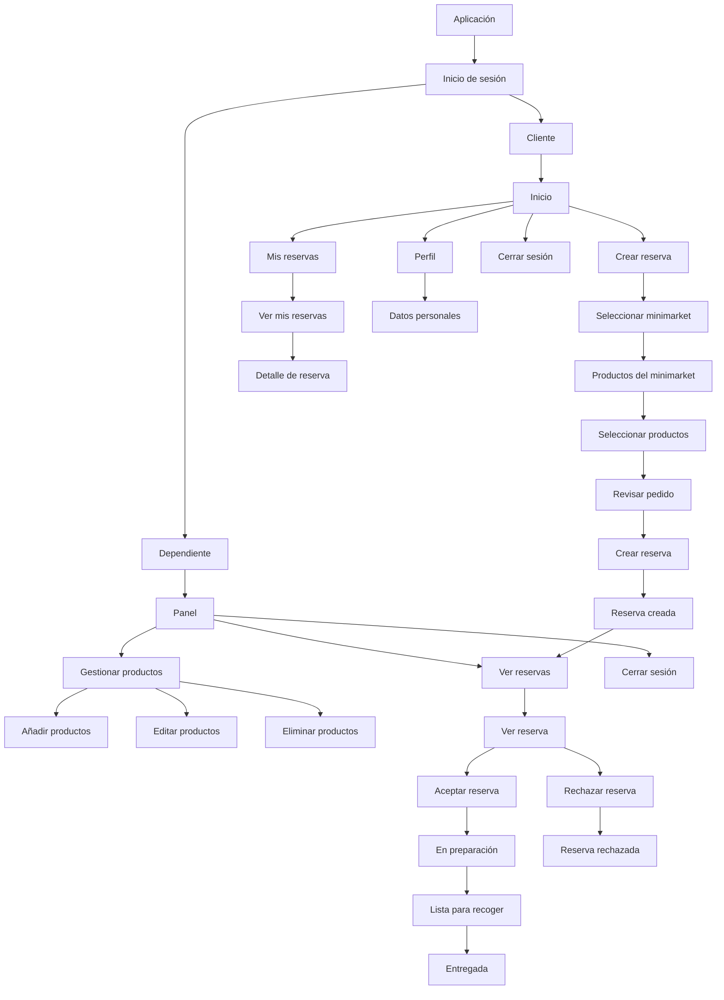

# app map


## Descripción del flujo

Flujo principal del sistema: **selección de minimarket → selección de productos → creación de reserva → revisión y confirmación por parte del dependiente**.

```
                         SISTEMA DE RESERVAS
                                  │
                         ┌────────┴────────┐
                         │                 │
                      CLIENTE          DEPENDIENTE
                         │                 │
              ┌──────────┼─────────┐       │
              │          │         │       │
           Iniciar     Crear     Mis      Panel
           sesión     reserva   reservas    │
              │          │         │        │
              │          │         │   ┌────┴──────────┐
              │          │         │   │               │
              │          │         │ Gestionar      Gestionar
              │          │         │ productos      reservas
              │          │         │   │               │
              │          │         │   ├─ Añadir       ├─ Ver reservas
              │          │         │   ├─ Editar       │
              │          │         │   └─ Eliminar     └─ Detalle reserva
              │          │         │                       │
              │          │         └─ Detalle               │
              │          │                                 │
              │       Seleccionar                           │
              │       minimarket                            │
              │          │                                  │
              │       Ver productos                         │
              │          │                                  │
              │       Seleccionar                           │
              │        productos                            │
              │          │                                  │
              │       Revisar pedido                         │
              │          │                                  │
              │       Crear reserva ────────────────────────┘
              │          │
              │       Reserva creada
              │
              │
           Cerrar sesión
```
