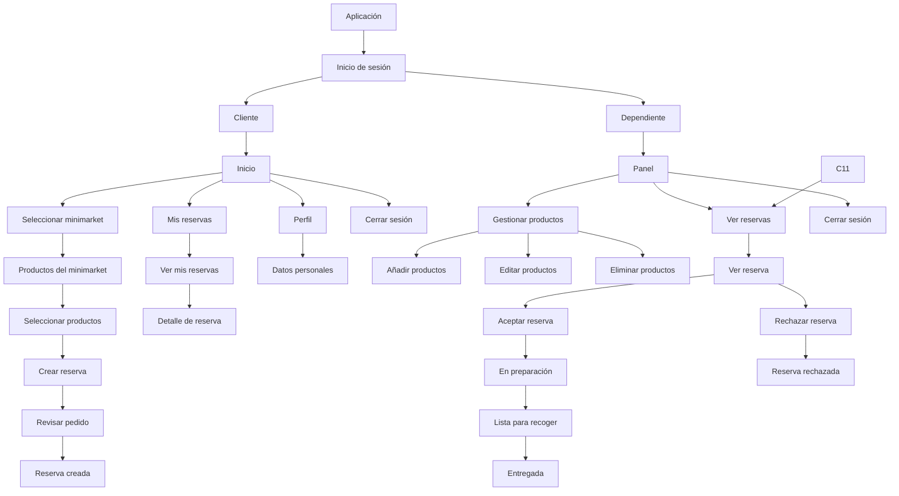

# app map


## Descripción del flujo

### Inicio de sesión

La aplicación comienza en la pantalla de **Inicio de sesión**. Una vez que el usuario inicia sesión, puede acceder a la aplicación como **Cliente** o **Dependiente**.

### Cliente

Al ingresar como **Cliente**, se muestra la pantalla de **Inicio**. Desde allí, el cliente puede:

* **Crear una reserva.**
* **Cerrar sesión.**

Al seleccionar **Crear reserva**, el cliente puede volver a la página anterior o seleccionar un **minimarket**.

Después de seleccionar un minimarket, se abre una página donde el cliente puede:

* Consultar los **productos disponibles**.
* Seleccionar los productos que desea reservar.
* **Enviar un mensaje al dependiente.**
* Volver a la selección de minimarkets.

Una vez seleccionados los productos, el cliente puede **crear la reserva**. La reserva queda registrada y pasa a estar disponible para que el dependiente pueda revisarla.

### Dependiente

Al ingresar como **Dependiente**, puede administrar los productos del minimarket y gestionar las reservas realizadas por los clientes.

Sus principales funciones son:

* **Añadir productos** al minimarket.
* **Eliminar productos** del minimarket.
* **Ver las reservas pendientes de confirmación.**
* **Aceptar o rechazar reservas.**
* **Cerrar sesión.**

Cuando el dependiente acepta una reserva, puede continuar gestionándola hasta que el pedido esté listo para ser recogido por el cliente.

### Flujo general

El flujo de la aplicación comienza con el **inicio de sesión** y se divide según el tipo de usuario:

* El **Cliente** selecciona un minimarket, consulta sus productos, selecciona los productos que desea y crea una reserva.
* El **Dependiente** recibe la reserva, la revisa y puede aceptarla o rechazarla.
* Si la reserva es aceptada, el dependiente puede gestionar su estado hasta que el pedido esté listo para ser entregado.
* Finalmente, ambos usuarios pueden **cerrar sesión**.


Flujo principal del sistema: **selección de minimarket → selección de productos → creación de reserva → revisión y confirmación por parte del dependiente**.

```
                         SISTEMA DE RESERVAS
                                  │
                         ┌────────┴────────┐
                         │                 │
                      CLIENTE          DEPENDIENTE
                         │                 │
              ┌──────────┼─────────┐       │
              │          │         │       │
           Iniciar     Crear     Mis      Panel
           sesión     reserva   reservas    │
              │          │         │        │
              │          │         │   ┌────┴──────────┐
              │          │         │   │               │
              │          │         │ Gestionar      Gestionar
              │          │         │ productos      reservas
              │          │         │   │               │
              │          │         │   ├─ Añadir       ├─ Ver reservas
              │          │         │   ├─ Editar       │
              │          │         │   └─ Eliminar     └─ Detalle reserva
              │          │         │                       │
              │          │         └─ Detalle               │
              │          │                                 │
              │       Seleccionar                           │
              │       minimarket                            │
              │          │                                  │
              │       Ver productos                         │
              │          │                                  │
              │       Seleccionar                           │
              │        productos                            │
              │          │                                  │
              │       Revisar pedido                         │
              │          │                                  │
              │       Crear reserva ────────────────────────┘
              │          │
              │       Reserva creada
              │
              │
           Cerrar sesión
```
