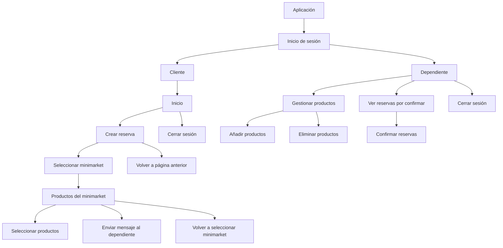

# Persona V0.1
Nombre: Carlos 40 años
Situacion: Es una persona organizada y previsora que realiza compras de abastecimiento o reposición para su hogar. Planifica sus salidas con antelación revisando lo que le falta en casa para no hacer compras improvisadas.
Objetivo: Hacer sus compras en un solo lugar, de forma rápida y eficiente, sin perder tiempo buscando productos en los pasillos ni haciendo filas.
Dificultad: Le molesta perder tiempo dando vueltas en la tienda para no encontrar lo que busca, tener que ir a varios locales para completar su lista, o quedarse atascado en cajas lentas.
Necesidad: Garantizar que los productos que busca estén disponibles en el local al que va y poder agilizar el proceso de recolección y pago antes de salir de casa.


# app map


## Descripción del flujo

### Inicio de sesión

La aplicación comienza en la pantalla de **Inicio de sesión**. Una vez que el usuario inicia sesión, puede acceder a la aplicación como **Cliente** o **Dependiente**.

### Cliente

Al ingresar como **Cliente**, se muestra la pantalla de **Inicio**. Desde allí, el cliente puede:

* **Crear una reserva.**
* **Cerrar sesión.**

Al seleccionar **Crear reserva**, el cliente puede volver a la página anterior o seleccionar un **minimarket**.

Después de seleccionar un minimarket, se abre una página donde el cliente puede:

* Consultar los **productos disponibles**.
* Seleccionar los productos que desea reservar.
* **Enviar un mensaje al dependiente**.
* Volver a la selección de minimarkets.

### Dependiente

Al ingresar como **Dependiente**, puede administrar el minimarket y gestionar las reservas.

Sus principales funciones son:

* **Añadir productos** al minimarket.
* **Eliminar productos** del minimarket.
* **Ver las reservas pendientes de confirmación.**
* **Cerrar sesión.**

```
```
